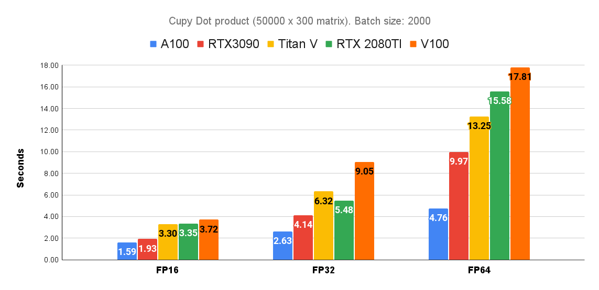

# Matrix Benchmark

A cupy (GPU) / numpy (Numpy) benchmark to measure how fast different hardware can perform matrix operations. The benchmark tests operations commonly used in the word embedding research field. 

## Tests
* Matrix dot
* Squared Distance
* Euclidean distance
* K-nearest neighbours (dot)
* K-nearest neighbours (euclidean distance)

## Requeriments
* python3
* numpy
* cupy (GPU support)
* tqdm 

## Usage
```
python3 run_benchmark.py
```
You can test different batch sizes with the --gpy_batch_sizes parameter
```
python3 run_benchmark.py --gpu_batch_sizes 100 500 1000 2000
```

You can test different matrix sizes with the --matrix_size parameter

```
python3 run_benchmark.py --gpu_batch_sizes 100 500 1000 2000 --matrix_size 10000
```

To run the kkn / euclian distance / squared distance benchmarks use the --full_benchmark flag

```
python3 run_benchmark.py --full_benchmark
```

You can run the benchmark in FP16, Fp32 or FP64 (FP16 not supported for knn in current cupy version)

```
python3 run_benchmark.py --fp16
python3 run_benchmark.py --fp32
python3 run_benchmark.py --fp64
```

## Sample Output
```
---> Running benchmark <---
Device: GeForce RTX 2080 SUPER. FP32. Matrix size: 10000 x 300

Running dot task. Batch size: 1000. fp32. Time: 0.3407488663991292 seconds.
Running squared_distance task. Batch size: 1000. fp32. Time: 3.1240174770355225 seconds.
Running euclidean_distance task. Batch size: 1000. fp32. Time: 3.0890189011891684 seconds.
Running knn_dot task. Batch size: 1000. fp32. Time: 1.4538000424702961 seconds.
Running knn_euclidean_distance task. Batch size: 1000. fp32. Time: OUT OF MEMORY
```

## Benchmarks



To reproduce results:
```
python3 run_benchmark.py --gpu_batch_sizes 2000 --matrix_size 50000 --fp 16
python3 run_benchmark.py --gpu_batch_sizes 2000 --matrix_size 50000 --fp 32
python3 run_benchmark.py --gpu_batch_sizes 2000 --matrix_size 50000 --fp 64
```
